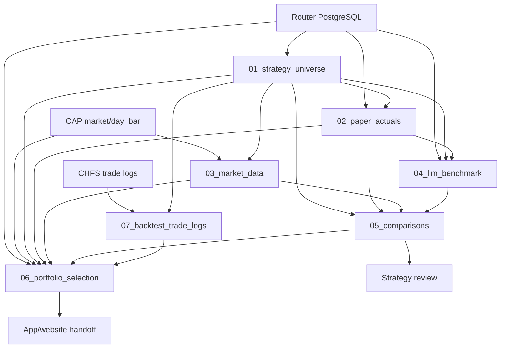

# Data Architecture

First principle: every artifact has one owner. Raw facts come from external systems; repo folders either preserve those facts, derive metrics from them, or publish final products. In the public repo, generated artifacts are ignored and regenerated locally.

## SSOT Map

| Folder | Runtime SSOT | Owns | Depends On |
| --- | --- | --- | --- |
| `01_strategy_universe/` | `strategies.json` | Canonical `strategy_id`, `session_id`, `target_asset`, `asset_type`, display metadata, ticker universe. | Router PostgreSQL |
| `02_paper_actuals/` | `paper_daily_rows.json`; `paper_compounded_summary.csv` | Observed paper rows and scripted paper return from daily `pnl`. | `01`, Router PostgreSQL |
| `03_market_data/` | `buy_hold_cap_day_bars.json`; `portfolio_benchmark_day_bars.csv` | Market close series used for buy-and-hold and fixed benchmark windows. | `01`, Router ref-price tables, CAP |
| `04_llm_benchmark/` | `llm_benchmark_rows.json`; `llm_benchmark_decisions.json` | LLM benchmark rows over each paper window. | `01`, `02`, Router PostgreSQL |
| `05_comparisons/` | `paper_minus_benchmarks_sorted.csv` | Strategy-level paper-vs-LLM and paper-vs-buy-hold rankings. | `01`, `02`, `03`, `04` |
| `06_portfolio_selection/` | `stock_equal_weight_portfolio.csv`; `crypto_equal_weight_portfolio.csv`; `portfolio_equity_curves.json`; `selection_audit.json` | Final stock/crypto portfolios, benchmark pass/fail, app/website curve handoff, market chart output, selection audit. | `01`, `02`, `03`, `05`, `07`, Router PostgreSQL, CAP |
| `07_backtest_trade_logs/` | `backtest_trade_log_index.csv`; `trade_logs/*.csv`; `backtest_compounded_summary.csv` | Downloaded strategy trade logs and scripted backtest return from daily `pnl`. | `01`, CHFS |
| `scripts/` | Script source files | Refresh, build, and verification process. | Repo data plus local ignored config |
| `fixtures/tiny/` | Tiny synthetic examples | Public schema reference only. | None |
| `config/` | `README.md`; examples; ignored `*.local.yaml` | Runtime connection config location. | Operator environment |

## Dependency Graph

## Minimal Calculations

| Layer | Calculation | Formula / Rule |
| --- | --- | --- |
| Paper compounding | Strategy paper return | `equity_t = equity_(t-1) * (1 + pnl_t)`; return is `equity_end - 1`. |
| Backtest compounding | Strategy backtest return | Same daily `pnl` compounding; `cum_return` is not used for `06` backtest curves. |
| Buy-and-hold | Ticker return over paper dates | `close_t / close_start - 1`. |
| `05` comparison | Paper edge | `paper_return - llm_return` and `paper_return - buy_hold_return`; pass only if all available benchmark edges are `>= 0`. |
| `06` selection | Component score | Strategy paper return and paper-vs-buy-hold evidence, with required strategy and trade-log coverage. |
| `06` portfolio | Equal-weight return | `sum(weight * component_return)`, with configured stock/crypto weights. |
| `06` curves | Portfolio equity | `sum(weight * close_t / close_start)` on common dates shared by selected components and benchmark. |

## Conflict Rule

If two generated files disagree, trust the nearest upstream SSOT and regenerate downstream artifacts with `scripts/` or the module-local build script. Do not manually edit generated CSV/JSON outputs.
